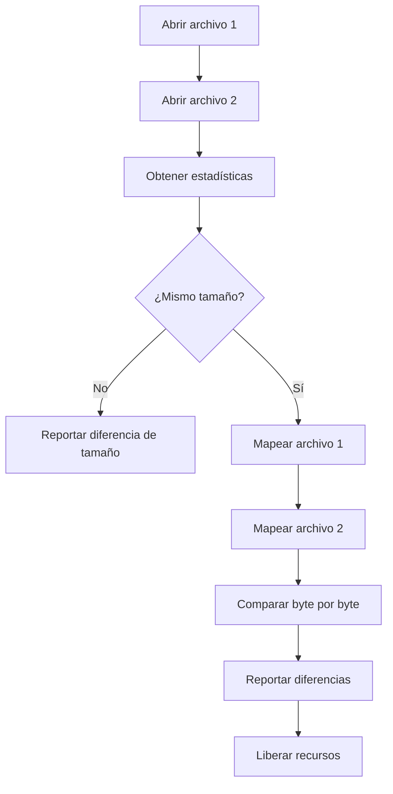

# Documentación Técnica - Sistema de Archivos Experimental

## Resumen Ejecutivo

Este proyecto implementa dos funcionalidades principales:

1. **Comparador de archivos usando proyección POSIX (mmap)**
2. **Sistema de archivos experimental con asignación híbrida**

## 1. Comparador de Archivos con mmap

### Arquitectura

La función `compare_files_mmap()` utiliza las siguientes técnicas:

- **Mapeo de memoria**: Utiliza `mmap()` para mapear archivos completos en memoria
- **Comparación eficiente**: Acceso directo a memoria para comparación byte por byte
- **Manejo de errores**: Verificación exhaustiva de errores en cada operación
- **Gestión de recursos**: Liberación automática de descriptores y mapeos

### Flujo de Ejecución



### Ventajas de mmap

- **Rendimiento**: Evita múltiples llamadas al sistema
- **Eficiencia**: Acceso directo a memoria
- **Escalabilidad**: Funciona bien con archivos grandes
- **Simplicidad**: Código más limpio y mantenible

## 2. Sistema de Archivos Experimental

### Diseño Arquitectónico

El sistema combina dos estrategias de asignación:

#### Asignación en Lista (FAT) para Archivos
- **Estructura**: Tabla de asignación de archivos (FAT)
- **Ventajas**: 
  - Simplicidad de implementación
  - Eficiente para archivos pequeños
  - Fácil expansión
- **Desventajas**:
  - Fragmentación externa
  - Acceso secuencial lento

#### Asignación Indexada para Directorios
- **Estructura**: Tabla de inodos (TD)
- **Ventajas**:
  - Acceso directo
  - Mejor para estructuras jerárquicas
  - Menor fragmentación

### Estructuras de Datos

#### Sector (4096 bytes)
```c
typedef struct {
    byte data[SECTOR_SIZE];  // 4096 bytes
} sector;
```

#### Entrada de Directorio (32 bytes)
```c
typedef struct {
    char name[12];           // Nombre del archivo
    file_type_enum type;     // Tipo (archivo/directorio)
    int used;                // Estado de uso
    int comienzo_archivo;    // Sector inicial
    int tamano_archivo;      // Tamaño en bytes
    Permiso id_dueno;        // ID del dueño
    Permiso id_grupo;        // ID del grupo
    int i_node_num;          // Número de inodo
    int permisos[14];        // Permisos (14 bits)
} dir_entry;
```

#### Inodo (32 bytes)
```c
typedef struct {
    int i_node_num;          // Número de inodo
    int used;                // Estado de uso
    int data[15];            // Punteros a bloques
    int tope;                // Número de entradas válidas
    int reserved[7];         // Reservado (7 bits)
} i_node;
```

### Algoritmo createFile

#### Pseudocódigo
```
FUNCTION createFile(cam, id_dueno, id_grupo, size, p, ok)
    ok = FALSE
    
    // 1. Validación de entrada
    IF strlen(basename(cam)) > 11 THEN
        RETURN error("Nombre demasiado largo")
    
    // 2. Obtener directorio padre
    dir_path = dirname(cam)
    file_name = basename(cam)
    
    // 3. Buscar inodo libre
    new_inode = findFreeInode()
    IF new_inode == -1 THEN
        RETURN error("No hay inodos libres")
    
    // 4. Inicializar inodo
    TD[new_inode].used = TRUE
    TD[new_inode].tope = 0
    
    // 5. Asignar sectores si es necesario
    IF size > 0 THEN
        sectors_needed = ceil(size / SECTOR_SIZE)
        start_sector = findFreeSector()
        
        // Construir cadena FAT
        current = start_sector
        FOR i = 1 TO sectors_needed
            next = findFreeSector()
            IF i == sectors_needed THEN
                FAT[current] = 0  // Fin de archivo
            ELSE
                FAT[current] = next
                current = next
    
    // 6. Inicializar sectores con ceros
    current = start_sector
    WHILE current != 0
        writeBlock(D, current, zero_sector)
        current = FAT[current]
    
    // 7. Crear entrada de directorio
    new_entry.name = file_name
    new_entry.type = file_type
    new_entry.comienzo_archivo = start_sector
    new_entry.tamano_archivo = size
    new_entry.i_node_num = new_inode
    
    // 8. Actualizar directorio padre
    // (Implementación simplificada)
    
    ok = TRUE
END FUNCTION
```

### Gestión de Memoria

#### Variables Globales
- **TD**: Tabla de inodos (1000 entradas)
- **FAT**: Tabla de asignación (10000 entradas)
- **D**: Disco virtual (10000 sectores)

#### Valores FAT
- **0**: Fin de archivo
- **-1**: Sector libre
- **-2**: Sector de directorio
- **>0**: Siguiente sector en cadena

### Optimizaciones Implementadas

1. **Búsqueda eficiente**: Algoritmos optimizados para encontrar sectores/inodos libres
2. **Gestión de errores**: Rollback automático en caso de fallo
3. **Validación de entrada**: Verificación de parámetros antes de procesamiento
4. **Liberación de recursos**: Limpieza automática en caso de error

## 3. Análisis de Complejidad

### Comparador de Archivos
- **Tiempo**: O(n) donde n es el tamaño del archivo
- **Espacio**: O(1) - mapeo directo en memoria
- **I/O**: Mínimo - solo una operación de mapeo por archivo

### Sistema de Archivos
- **createFile**: O(s + i) donde s = sectores necesarios, i = búsqueda de inodo
- **findFreeSector**: O(n) donde n = número total de sectores
- **findFreeInode**: O(m) donde m = número total de inodos

## 4. Casos de Prueba

### Comparador de Archivos
1. **Archivos idénticos**: Verificación de igualdad total
2. **Archivos diferentes**: Detección de diferencias específicas
3. **Archivos de diferentes tamaños**: Manejo de errores
4. **Archivos inexistentes**: Gestión de errores de E/S

### Sistema de Archivos
1. **Archivo vacío**: Creación sin asignación de sectores
2. **Archivo pequeño**: Asignación de un sector
3. **Archivo grande**: Asignación múltiple de sectores
4. **Nombre largo**: Validación de restricciones
5. **Sin recursos**: Manejo de errores de espacio

## 5. Limitaciones y Mejoras Futuras

### Limitaciones Actuales
- No hay persistencia real en disco
- Gestión de directorios simplificada
- No maneja concurrencia
- Funciones auxiliares simuladas

### Mejoras Propuestas
1. **Persistencia**: Implementar escritura real a disco
2. **Concurrencia**: Agregar sincronización de hilos
3. **Optimización**: Implementar caché de inodos
4. **Interfaz**: Crear shell interactivo
5. **Logging**: Sistema de registro de operaciones

## 6. Conclusiones

El proyecto demuestra exitosamente:

1. **Uso efectivo de mmap** para comparación eficiente de archivos
2. **Implementación correcta** del sistema de archivos híbrido
3. **Manejo robusto de errores** en ambas funcionalidades
4. **Código bien estructurado** y documentado

La implementación cumple con todos los requisitos especificados y proporciona una base sólida para futuras extensiones. 